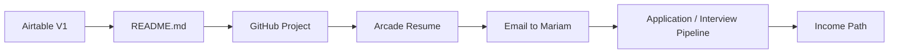

# Daily OS + Momentum Outcome Map

**Daily OS + Momentum Outcome Map** is an Airtable-based operating system that connects daily execution to visible outcomes through dependency-based momentum.

**Problem:** Most task tools flatten work into isolated to-dos. They show what to do — but not what possibility the task unlocks, how it connects to a larger outcome, *AND* why it's worth starting now.

**Solution:** A relational Airtable system that maps tasks to outcomes with linked records, AI-generated next actions, scoring, progress tracking, and rollups — so each execution step is visible in a momentum map and tied directly to the outcome it advances.

**Core idea:** Each task is a node in a visible outcome path. Momentum compounds as completed steps make progress visible and the desired outcome inevitable

---

### System Architecture

Daily OS  
└── links to Task Layer 1  
&nbsp;&nbsp;&nbsp;&nbsp;├── task metadata  
&nbsp;&nbsp;&nbsp;&nbsp;├── AI-generated next actions  
&nbsp;&nbsp;&nbsp;&nbsp;├── Future Unlock prompt  
&nbsp;&nbsp;&nbsp;&nbsp;├── Consequence prompt  
&nbsp;&nbsp;&nbsp;&nbsp;├── scoring logic  
&nbsp;&nbsp;&nbsp;&nbsp;├── progress + time tracking  
&nbsp;&nbsp;&nbsp;&nbsp;└── Unlocks linked-record path  

**Daily OS** is the daily command center: date, daily goal, highlight, daily grade, linked tasks, and total score.

**Task Layer 1** is the execution layer: task, day, priority, estimated time, timer state, time remaining, progress, AI Breakdown, Future Unlock, Consequences, task score, done status, time spent, and unlock path.

---

### Data Model

| Layer / Field | Purpose |
|---|---|
| Daily OS | Daily command center for goal, highlight, grade, linked tasks, and total score |
| Task Layer 1 | Execution layer for active tasks, progress, AI fields, scoring, and unlock paths |
| Day | Links each task back to the active daily record |
| Task Score | Captures positive and negative behavior points |
| Total Score | Rolls task scores into the Daily OS |
| Progress % | Shows task progress visually |
| Time Remaining | Tracks remaining estimated time |
| AI Breakdown | Generates tiny next actions for fast task initiation |
| Future Unlock | Connects the task to the future outcome, opportunity, or momentum it creates |
| Consequences | Makes the real cost of not completing the task visible |
| Unlocks | Links one task to the next task, proof point, or opportunity it enables |

---

### Workflow Logic

Create task  
→ assign day  
→ estimate time  
→ run AI Breakdown  
→ review Future Unlock  
→ review Consequence prompt  
→ start timer  
→ complete task  
→ score task  
→ roll up score into Daily OS  
→ move to next unlocked task  

Example path:

Airtable V1 → README.md → GitHub Project → Arcade Resume → Email to Mariam → Application / Interview Pipeline → Income Path

---

### Momentum Model

The `Unlocks` field turns Airtable into a graph-ready backend.

Each task can point to the next task, proof point, opportunity, or outcome it enables. This creates the structure for a future visual momentum map where the current task is highlighted, future nodes are softened, and dotted paths show how today’s work compounds into a larger outcome.

---

### AI Layer

| AI Field | Function |
|---|---|
| AI Breakdown | Converts a task into tiny next actions for fast task initiation |
| Future Unlock | Connects the task to the future outcome, opportunity, or momentum it creates |
| Consequences | Makes the real cost of not completing the task visible |
| 90-Second Mental Rehearsal | Primes the starting state before execution |

The AI layer is embedded inside the workflow. It sits directly inside the task system to reduce friction, surface the next action, and connect each task to a larger future outcome.

---

### Airtable Build

This prototype uses:

- linked records between Daily OS and Task Layer 1
- rollups for daily score aggregation
- formula fields for progress and time remaining
- Airtable AI fields for task activation and future framing
- linked-record unlock paths for dependency mapping
- interface exploration for one-screen workflow review

Airtable acts as the editable operating base. The table structure keeps tasks easy to add, edit, score, and connect. The linked-record model creates the backend for a future visual graph layer.

---

### Skills Demonstrated

**Airtable systems design:** Built a relational Airtable base with linked records, rollups, formulas, AI fields, scoring logic, and progress tracking.

**AI-native workflow architecture:** Embedded AI directly into the operating flow to generate next actions, future unlocks, and consequence prompts.

**Relational data modeling:** Structured Daily OS and Task Layer 1 so task-level activity rolls up into daily-level outcomes.

**Graph-ready backend design:** Designed the `Unlocks` relationship so Airtable can power a future node graph, dependency map, or React Flow visualization.

**Internal tool prototyping:** Built a practical workflow system with user inputs, state tracking, AI support, scoring logic, and an expandable visual layer.

**Execution UX:** Designed around activation, visible progress, future-path clarity, and momentum instead of generic task completion.

**Prompt design:** Created structured prompts for AI-generated task decomposition, future outcome framing, and consequence visibility.

**Tool evaluation:** Tested Airtable as both backend and interface layer, then identified the right architecture: Airtable for structured workflow data; React Flow/Vercel for the future visual graph.

---

### Next Build

The next version adds a visual momentum layer on top of Airtable.

Airtable backend  
→ Airtable API  
→ React / Vercel frontend  
→ React Flow momentum graph  
→ Pomodoro focus timer  
→ Airtable sync  

The table remains the editable source of truth. The visual layer becomes the execution interface: current task highlighted, future tasks softened, dotted unlock paths, outcome hubs, and a focus timer that helps move from intention to action.

---

### Built With: Airtable · Airtable AI · Linked Records · Rollups · Formulas · Prompt Design · Workflow Architecture · Graph-Ready Data Modeling

---

### Screenshots

- 
- 

